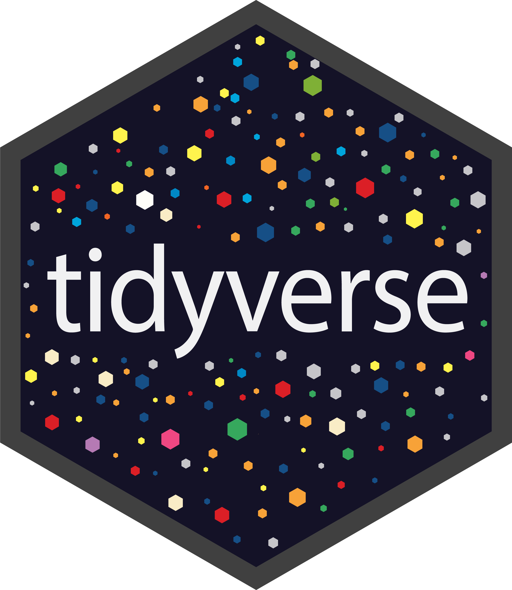

## Hi there, my name is Erika 👋

I am a coding enthusiast with interest in data analysis, machine learning, Shiny app and web development.

### About Me
💻 Currently working as a Bioinformatician at Pentabase A/S
 
👨‍💻 Experienced in Bioinformatics, 🧬DNA Sequencing and R
 
🎓 Hold a MSc degree in Engineering (Biotechnology)
 
📚 Learning web-development technologies
 
🏋️‍♀️ I enjoy gym and 🎮 gaming in my free time

### Languages

   
 

### Technologies
 

### Libaries

### 🤝🔗 Connect with me:

### GitHub Statistics

